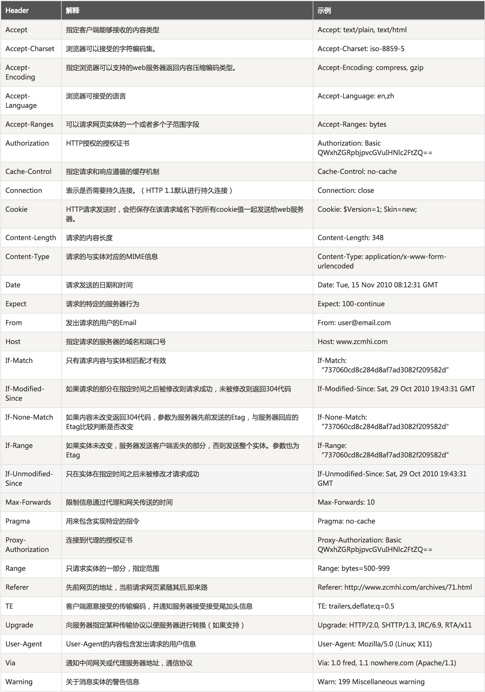

# HTTP

### 什么是HTTP

**超文本传输协议(HTTP，HyperText Transfer Protocol)**，由万维网协会（World Wide Web Consortium）和互联网工程小组（Internet Engineering Task Force ）共同合作研究，最终发布了一系列的RFC ，其中著名的RFC 2616定义了HTTP 1.1。

客户端喝服务器请求和应答时都需要遵循相同的协议。HTTP 服务默认端口号为80**当HTTP客户端发送请求时，服务端需要响应请求。**响应中需要包含状态行，"HTTP/1.1 200 OK"和响应的信息，可能还包含错误的等。

### 什么是URI，URL和URN?

URI: Uniform Resource Identifier ，统一资源标识符

URL:Uniform Resource Locator，统一资源定位符

URN:Uniform Resource Name，统一资源名称

**URL,URN是URL的子集，或者说URI是一种表准，URL和URN是一种现实**

### 请求方法

* OPTIONS：这个方法可使服务器传回该资源所支持的所有HTTP请求方法。用'*'来代替资源名称，向Web服务器发送OPTIONS请求，可以测试服务器功能是否正常运作。
* HEAD：与GET方法一样，都是向服务器发出指定资源的请求。只不过服务器将不传回资源的本文部分。它的好处在于，使用这个方法可以在不必传输全部内容的情况下，就可以获取其中“关于该资源的信息”（元信息或称元数据）。
* GET：向指定的资源发出“显示”请求。使用GET方法应该只用在读取数据，而不应当被用于产生“副作用”的操作中，例如在[Web Application](https://zh.wikipedia.org/wiki/%E7%B6%B2%E9%A0%81%E6%87%89%E7%94%A8%E7%A8%8B%E5%BC%8F)中。其中一个原因是GET可能会被[网络蜘蛛](https://zh.wikipedia.org/wiki/%E7%BD%91%E7%BB%9C%E8%9C%98%E8%9B%9B)等随意访问。参见[安全方法](https://zh.wikipedia.org/wiki/%E8%B6%85%E6%96%87%E6%9C%AC%E4%BC%A0%E8%BE%93%E5%8D%8F%E8%AE%AE#.E5.AE.89.E5.85.A8.E6.96.B9.E6.B3.95)
* POST：向指定资源提交数据，请求服务器进行处理（例如提交表单或者上传文件）。数据被包含在请求本文中。这个请求可能会创建新的资源或修改现有资源，或二者皆有。
* PUT：向指定资源位置上传其最新内容。


* DELETE：请求服务器删除Request-URI所标识的资源。
* TRACE：回显服务器收到的请求，主要用于测试或诊断。
* CONNECT：HTTP/1.1协议中预留给能够将连接改为管道方式的代理服务器。通常用于SSL加密服务器的链接（经由非加密的HTTP代理服务器）。

方法名称是区分大小写的。当某个请求所针对的资源不支持对应的请求方法的时候，服务器应当返回[状态码405](https://zh.wikipedia.org/wiki/HTTP%E7%8A%B6%E6%80%81%E7%A0%81#405)（Method Not Allowed），当服务器不认识或者不支持对应的请求方法的时候，应当返回[状态码501]（Not Implemented）。

* PATCH:用于将局部修改应用到资源。

### 版本信息

* 0.9

已过时。只接受GET一种请求方法，没有在通讯中指定版本号，且不支持请求头。由于该版本不支持POST方法，因此客户端无法向服务器传递太多信息。

* HTTP/1.0

这是第一个在通讯中指定版本号的HTTP协议版本，至今仍被广泛采用，特别是在[代理服务器](https://zh.wikipedia.org/wiki/%E4%BB%A3%E7%90%86%E6%9C%8D%E5%8A%A1%E5%99%A8)中。

* HTTP/1.1

持久连接被默认采用，并能很好地配合代理服务器工作。还支持以[管道方式](https://zh.wikipedia.org/wiki/HTTP%E7%AE%A1%E7%BA%BF%E5%8C%96)在同时发送多个请求，以便降低线路负载，提高传输速度。

HTTP/1.1相较于HTTP/1.0协议的区别主要体现在：

 缓存处理

 带宽优化及网络连接的使用

 错误通知的管理

 消息在网络中的发送

 互联网地址的维护

 安全性及完整性

* HTTP/2

当前版本，于2015年5月作为互联网标准正式发布

### 状态码

所有HTTP响应的第一行都是**状态行**，依次是当前HTTP版本号，3位数字组成的[状态代码](https://zh.wikipedia.org/wiki/HTTP%E7%8A%B6%E6%80%81%E7%A0%81)，以及描述状态的短语，彼此由空格分隔。

例：HTTP/1.1 200 OK

状态代码的第一个数字代表当前响应的类型：

* 1xx消息——请求已被服务器接收，继续处理
* 2xx成功——请求已成功被服务器接收、理解、并接受
* 3xx重定向——需要后续操作才能完成这一请求
* 4xx请求错误——请求含有词法错误或者无法被执行
* 5xx服务器错误——服务器在处理某个正确请求时发生错误

### 请求头

​                                          

### 响应头


### 请求体

一般为请求所需参数，例：LoginName=180xxxxxxxx&LoginPassword=EAXXFDJKLSJAFLDSAJ

### 响应体

一般为服务器响应的数据，例：

```
{
  "Result": "1",
  "Error": "",
  "ListValues": null,
  "ItemValues": null,
  "SingleValues": "B5826ee19f125a3aa",
  "ConfigValues": null
}
```

Request

由三部分组成，请求行＋请求头＋请求体

例：

```
GET http://127.0.0.1 HTTP/1.1
Host: 127.0.0.1
Content-Length:348
Content-Type: application/x-www-form-unurlencoded

LoginName=180xxxxxxxx&LoginPassword=EAXXFDJKLSJAFLDSAJ
```

### Response

由三部分组成，状态行＋响应头＋响应体

例：

```
HTTP/1.1 200 OK
Content-Type →application/json; charset=utf-8
Date →Tue, 14 Feb 2017 08:09:50 GMT
Server →Apache
Content-Length →118
{
  "Result": "1",
  "Error": "",
  "ListValues": null,
  "ItemValues": null,
  "SingleValues": "B5826ee19f125a3aa",
  "ConfigValues": null
}
```

### 参考文章

[维基百科:HTTP超文本传输协议](https://zh.wikipedia.org/wiki/%E8%B6%85%E6%96%87%E6%9C%AC%E4%BC%A0%E8%BE%93%E5%8D%8F%E8%AE%AE)

[百度百科:hppt](http://baike.baidu.com/item/http)

[百度百科:URI](http://baike.baidu.com/item/URI/2901761)

[RFC](http://baike.baidu.com/subview/6108/5073689.htm#viewPageContent)

[HTTP-Header](http://tools.jb51.net/table/http_header)

[百度百科:RFC](http://baike.baidu.com/item/RFC/1840)

### 相关工具

[PostMan]()

Mac终端工具：telnet

### Git讲解

```
git clone

git add .

git commit -m

git push

git pull
```

将修改从暂存区移除

```
git rm --cache <file>
```

将修改添加到暂存区

```
git add <file>
```

查询git状态

```
git status
```

查询当前某文件与分支或暂存区中有何不同

```
git diff HEAD --<file>
```

### 忽略特殊文件／文件夹

需要生成.gitignore文件，一般来说，不需要自己创建

通过  Gitignore ：[https://github.com/github/gitignore] 地址去下载对应语言的.gitignore文件

> 例：使用node.js开发，则去下载Node.gitignore文件。

使用时，需要将Node.gitignore改名为.gitignore才会生效。

#### .gitignore

在该文件中添加忽略规则，可以填入＊＊文件名／文件夹名。

在.gitignore中添加如下代码

```
node_modules/
```

则该文件夹下所有文件／文件夹都会被.git忽略


